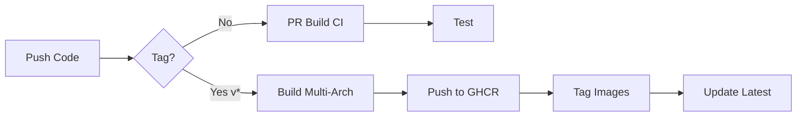

# GitHub Actions Workflow Specifications

**Feature**: 002-docker-deployment
**Date**: 2025-10-15

## Overview

Specification for GitHub Actions workflows to build, test, and publish Docker images to GitHub Container Registry.

## Workflow 1: docker-build.yml

**Purpose**: Validate Docker builds on pull requests

**Trigger**: Pull requests to main branch

**Jobs**:

### Job: build-test

**Runs-on**: ubuntu-latest

**Steps**:
1. **Checkout**: Check out repository code
2. **Setup Buildx**: Configure Docker Buildx for advanced builds
3. **Build Image**: Build Docker image without pushing
4. **Test Container**: Run container and execute tests
5. **Check Size**: Verify image size is under 500MB

**Outputs**: Build success/failure status

**Example YAML Structure**:
```yaml
name: Docker Build CI

on:
  pull_request:
    branches: [main]
    paths:
      - 'Dockerfile'
      - 'src/**'
      - 'requirements.txt'
      - '.github/workflows/docker-build.yml'

jobs:
  build-test:
    runs-on: ubuntu-latest
    steps:
      - name: Checkout code
        uses: actions/checkout@v4

      - name: Set up Docker Buildx
        uses: docker/setup-buildx-action@v3

      - name: Build Docker image
        uses: docker/build-push-action@v5
        with:
          context: .
          push: false
          tags: reddit-deliver:test
          cache-from: type=gha
          cache-to: type=gha,mode=max

      - name: Test container startup
        run: |
          docker run --rm reddit-deliver:test reddit-deliver --version

      - name: Check image size
        run: |
          SIZE=$(docker image inspect reddit-deliver:test --format='{{.Size}}')
          SIZE_MB=$((SIZE / 1024 / 1024))
          echo "Image size: ${SIZE_MB}MB"
          if [ $SIZE_MB -gt 500 ]; then
            echo "Error: Image size exceeds 500MB"
            exit 1
          fi
```

---

## Workflow 2: docker-publish.yml

**Purpose**: Build multi-arch images and publish to GHCR on release

**Trigger**:
- Tags matching `v*` (e.g., v0.1.0, v1.2.3)
- Manual workflow_dispatch

**Jobs**:

### Job: publish

**Runs-on**: ubuntu-latest

**Permissions**:
- contents: read
- packages: write

**Steps**:
1. **Checkout**: Check out repository code
2. **Docker Meta**: Extract tags and labels from git ref
3. **Setup QEMU**: Enable multi-arch emulation
4. **Setup Buildx**: Configure Docker Buildx
5. **Login to GHCR**: Authenticate to GitHub Container Registry
6. **Build and Push**: Build for AMD64 and ARM64, push to GHCR
7. **Update Description**: Sync README to GHCR image description

**Outputs**: Published image tags

**Example YAML Structure**:
```yaml
name: Publish Docker Image

on:
  push:
    tags:
      - 'v*'
  workflow_dispatch:

env:
  REGISTRY: ghcr.io
  IMAGE_NAME: ${{ github.repository }}

jobs:
  publish:
    runs-on: ubuntu-latest
    permissions:
      contents: read
      packages: write

    steps:
      - name: Checkout code
        uses: actions/checkout@v4

      - name: Docker meta
        id: meta
        uses: docker/metadata-action@v5
        with:
          images: ${{ env.REGISTRY }}/${{ env.IMAGE_NAME }}
          tags: |
            type=ref,event=branch
            type=semver,pattern={{version}}
            type=semver,pattern={{major}}.{{minor}}
            type=semver,pattern={{major}}
            type=sha

      - name: Set up QEMU
        uses: docker/setup-qemu-action@v3

      - name: Set up Docker Buildx
        uses: docker/setup-buildx-action@v3

      - name: Log in to GHCR
        uses: docker/login-action@v3
        with:
          registry: ${{ env.REGISTRY }}
          username: ${{ github.actor }}
          password: ${{ secrets.GITHUB_TOKEN }}

      - name: Build and push
        uses: docker/build-push-action@v5
        with:
          context: .
          platforms: linux/amd64,linux/arm64
          push: true
          tags: ${{ steps.meta.outputs.tags }}
          labels: ${{ steps.meta.outputs.labels }}
          cache-from: type=gha
          cache-to: type=gha,mode=max

      - name: Image digest
        run: echo ${{ steps.meta.outputs.digest }}
```

---

## Workflow 3: docker-scan.yml (Optional Security)

**Purpose**: Scan Docker images for vulnerabilities

**Trigger**:
- Schedule (weekly)
- Manual workflow_dispatch

**Jobs**:

### Job: scan

**Runs-on**: ubuntu-latest

**Steps**:
1. **Pull Image**: Pull latest image from GHCR
2. **Scan with Trivy**: Run vulnerability scanner
3. **Upload Results**: Upload SARIF to GitHub Security

**Example YAML Structure**:
```yaml
name: Docker Security Scan

on:
  schedule:
    - cron: '0 0 * * 0'  # Weekly on Sunday
  workflow_dispatch:

jobs:
  scan:
    runs-on: ubuntu-latest
    steps:
      - name: Pull latest image
        run: docker pull ghcr.io/${{ github.repository }}:latest

      - name: Run Trivy scanner
        uses: aquasecurity/trivy-action@master
        with:
          image-ref: ghcr.io/${{ github.repository }}:latest
          format: 'sarif'
          output: 'trivy-results.sarif'

      - name: Upload Trivy results
        uses: github/codeql-action/upload-sarif@v2
        with:
          sarif_file: 'trivy-results.sarif'
```

---

## Image Naming Convention

**Registry**: `ghcr.io`

**Repository**: `ghcr.io/<username>/<repository>`

**Tags**:
- `latest`: Most recent release
- `v0.1.0`: Specific semantic version
- `v0.1`: Minor version (updates with patches)
- `v0`: Major version (updates with minors)
- `sha-abc1234`: Git commit SHA

**Examples**:
```
ghcr.io/yourusername/reddit-deliver:latest
ghcr.io/yourusername/reddit-deliver:v0.1.0
ghcr.io/yourusername/reddit-deliver:v0.1
ghcr.io/yourusername/reddit-deliver:sha-abc1234
```

---

## Secrets Configuration

**Required GitHub Secrets**: NONE (uses GITHUB_TOKEN automatically)

**Optional Secrets**:
- `DOCKER_HUB_USERNAME`: If also publishing to Docker Hub
- `DOCKER_HUB_TOKEN`: If also publishing to Docker Hub

**Repository Settings**:
1. Go to Settings → Actions → General
2. Workflow permissions: "Read and write permissions"
3. Enable "Allow GitHub Actions to create and approve pull requests"

---

## Cache Strategy

**GitHub Actions Cache**:
- Type: `gha` (GitHub Actions cache)
- Mode: `max` (cache all layers)
- Benefit: 50-80% faster rebuilds
- Storage: 10GB limit per repository

**Cache Keys**:
- Dependencies: `requirements.txt` content hash
- Source: `src/**` file hashes
- Invalidation: Automatic when files change

---

## Multi-Arch Build Matrix

| Architecture | Platform | Use Cases |
|--------------|----------|-----------|
| AMD64 (x86_64) | linux/amd64 | Intel/AMD servers, most VPS |
| ARM64 (aarch64) | linux/arm64 | Apple Silicon (M1/M2), Raspberry Pi, AWS Graviton |

**Build Time Comparison**:
- Single arch (AMD64): ~3-5 minutes
- Multi-arch (both): ~8-12 minutes
- Cached build: ~1-2 minutes

---

## Error Handling

**Build Failures**:
- PR builds must pass before merge
- Failed builds block tag creation
- Notifications via GitHub UI

**Push Failures**:
- Retry logic built into actions
- Manual re-run available
- Check GHCR service status

**Size Limit Exceeded**:
- Build fails if image > 500MB
- Review dependencies and layers
- Optimize Dockerfile

---

## Testing Requirements

**Container Tests**:
1. ✅ Image builds successfully
2. ✅ Container starts without errors
3. ✅ `reddit-deliver --version` works
4. ✅ Database initialization succeeds
5. ✅ Health check responds
6. ✅ Image size under 500MB

**Integration Tests** (optional):
- Mount test .env with dummy credentials
- Run `monitor start --once`
- Verify no crashes

---

## Deployment Flow



**Steps**:
1. Developer pushes code to feature branch
2. PR created → docker-build.yml runs
3. Code merged to main
4. Maintainer creates release tag (v0.1.0)
5. docker-publish.yml triggers
6. Multi-arch images built and pushed to GHCR
7. Users can pull `ghcr.io/username/reddit-deliver:v0.1.0`

---

## Success Criteria

- ✅ PR builds complete in under 5 minutes
- ✅ Release builds complete in under 15 minutes
- ✅ Images publish successfully to GHCR
- ✅ Both AMD64 and ARM64 images available
- ✅ Image size under 500MB
- ✅ No manual secrets required
- ✅ Cache reduces rebuild time by 50%+
